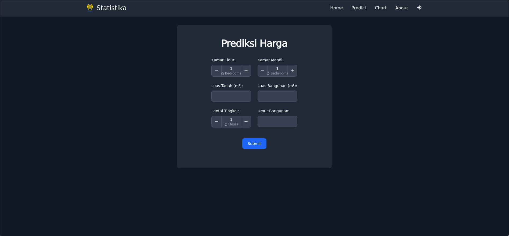

# Jabodetabek House Price Prediction

A machine learning project that predicts the price of a house based on the features of the house.



## Dataset

The dataset used in this project is collected from Kaggle. You can download the dataset [here](https://www.kaggle.com/datasets/nafisbarizki/daftar-harga-rumah-jabodetabek)

## Main Features

- Predict the price of a house based on the features of the house.
- Using linear regression to predict the price of a house.
- Machine learning model performance evaluation chart.

## Tech Stack

- Python
- Pandas
- Numpy
- Matplotlib
- Seaborn
- Scikit-learn
- Flask
- Tailwind CSS
- Flowbite

## How to run the project

```bash
git clone https://github.com/januarpancaran/jabodetabek-house-price-prediction.git
cd jabodetabek-house-price-prediction
python3 -m venv .venv
source .venv/bin/activate
pip install -r requirements.txt
```
